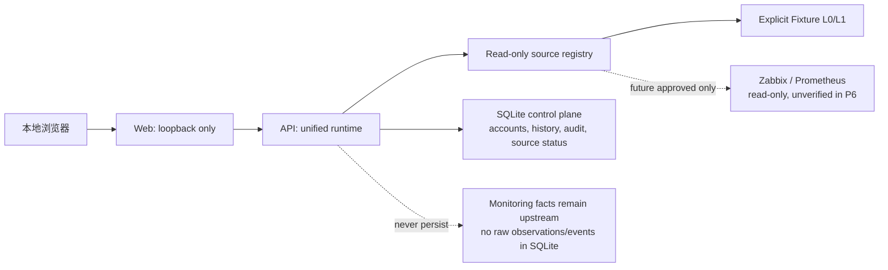

# AskLily 工程基线

- 状态：已批准并可施工
- 规范版本：v0.1
- 归档渲染件：[工程开工文档 PDF](../../output/pdf/AskLily_工程开工文档_v0.1.pdf)
- PDF SHA-256：`9969af91eb371c23daa0cacf9247c433fdb5554a4e7e9f6ac12c9bb0c2dee246`
- 当前 `main` 集成基线：`21afa61a567d647a059fcc694e6019c6eb445a77`
- 待收敛冻结基线：`efd5dc15e71bd8c677db0067d3cbab1912575db3`（P5；尚未合并至 `main`）

## 文档地位与冲突规则

本文件是工程开工文档的 Git 可追踪 Markdown 基线；同名 PDF 是经过审核的归档渲染件。新 Agent 必须先读取本文件及其所引用的 ADR、阶段报告和 Capability Brief，不得只依赖本机工作区中的文件。

规范优先级如下：

1. 项目负责人在任务或 ADR 中作出的明确、可追溯决定。
2. 已接受的 ADR。
3. 已合并阶段的最终关闭记录。
4. 本工程基线与其归档 PDF。
5. Capability Brief、任务协议和阶段执行计划。

当较高优先级文档与较低优先级文档冲突时，以较高优先级为准，并在下一次相关报告中说明差异。开工 PDF 中“私有 GitHub 仓库”的默认假设已由 [ADR-0001](../adr/0001-public-repository-for-branch-protection.md) 覆盖：当前仓库为公开仓库，敏感数据边界更严格。

## 已确认的产品与架构方向

AskLily 是面向 GPU 数据中心及相关运维环境的 AI 驱动运维平台。用户应能在授权范围内通过对话查询资产、事件、指标、链路和健康状态；复杂问题可进入 Workspace，自动定位资源、筛选条件和时间范围。

- 系统以模块化单体加异步 Worker 起步；不因预期规模过早拆分微服务。
- 前端采用 React + TypeScript；API、领域服务、Connector 和 Agent 编排采用 Python + FastAPI。Go 仅在容量证据证明需要时用于独立高吞吐模块；Rust 不在首期范围。
- Chat 和 Workspace 是同一会话的两种布局状态。Chat 返回文字结论和 `ViewContext`；Workspace 根据 `ViewContext` 从领域 API 请求结构化、可刷新、可分页的数据，绝不解析自然语言回答生成页面数据。
- 管理者通过 Capability Catalog 了解平台能力。Catalog 从 Capability Registry 生成；Tool Registry 与 API 文档分别面向 Agent 和开发集成；Wiki/仓库文档记录设计原因、手册和排障知识。
- 第一阶段严格只读。不得执行设备配置、工单写入、自动修复或其他业务写操作。

## 最小公共模型与契约

跨模块公共模型只包含必要语义：

| 对象 | 作用 |
| --- | --- |
| `Resource` | 可管理、授权和展示的资源身份与归属。 |
| `ResourceRelation` | 资源间的拓扑或从属关系。 |
| `Observation` | 带来源和时间戳的观测事实。 |
| `Event` | 去重后的异常及其状态演进。 |
| `HealthAssessment` | 由领域规则生成、可引用证据的健康结论。 |
| `Scope` | 服务端从身份生成的数据与动作边界。 |

事实、事件和结论必须分离。例如，RX 光功率是 `Observation`，持续阈值违规可形成 `Event`，严重状态才是 `HealthAssessment`。Agent 只引用已返回的结构化事实和结论，不自行制造业务事实。

以下契约需要版本化，并在破坏性变更时建立 ADR：API Contract、Tool Contract、View Contract、Connector Contract 和 Capability Manifest。现行最小契约详见 [P1 平台契约](P1-platform-contracts.md)。

## 安全、数据与部署约束

- 项目之间采用独立数据平面；首期按“一套部署实例对应一个项目”实施，Production 才讨论多项目控制面。
- Scope 必须在会话、Agent、Tool、Domain Query、数据层和结果返回层重复执行。前端和 Agent 不可扩大 Scope，汇总数据同样必须受 Scope 限制。
- 当前仓库公开。不得提交 Token、endpoint、真实主机或 item 名称、原始指标、真实客户数据、`.env`、密钥、未脱敏日志或事故回放数据。
- 模型 Provider 必须是可替换边界。任何真实数据出网、持久化、模型接入或新的敏感数据类别都需要 ADR 和项目负责人批准。
- P4 的 Demo / Developer 与 Standalone Compose Profile 是历史已交付事实。项目负责人已决定在 P6 收敛为一套 Docker Compose 与镜像；在 P6 验收前不得把这一目标倒写为 P4 已验证结论。Kubernetes、HA、灾备、多区域和 Production 容量不在当前施工范围。
- 数据真实性分层为 L0 Fixture、L1 Synthetic Scenario、L2 校准合成数据、L3 脱敏回放、L4 真实只读。Demo 证据不能表述为 L4 或 Production 证据。

## 当前已交付状态

| 阶段 | 当前状态 | 可表述范围 |
| --- | --- | --- |
| P0 治理基线 | 已关闭 | GitHub 保护、任务模板、ADR、治理门禁。 |
| P1 平台骨架 | 已关闭 | Scope、契约、Registry、审计基础与 Chat/Workspace 壳。 |
| P2 光模块纵向切片 | 已关闭 | Fixture / Scenario 驱动的 Demo 能力。 |
| P3 Zabbix 只读预备 | 已关闭且 L4 延期 | Mock 预备与真实只读数据处理边界；未完成真实 L4。 |
| P4 Standalone 硬化 | 已关闭 | 受控单机无状态 Compose Profile；非 Production。 |
| P5 能力扩展 | 可继续，逐项审批 | P5A 前台、P5B 本地账号历史与 P5D 本机控制面已由 P6 纳入统一运行基线；新的 Capability 必须独立 Brief、任务协议与验收。 |
| P6 统一运行时与数据源架构收敛 | 已关闭并获接受 | 统一 Compose、持久化边界与数据源状态模型已完成独立验收；不开放真实 Connector、L4 或 Production。 |
| Production/商业化工程 | 暂停 | HA、Kubernetes、容量、灾备和 Production SLA 仍仅在商业化、工程化和容量证据出现后单独立项。 |

P3 的真实 Zabbix L4 仍延期。它只能在项目负责人提供专用只读环境、最小 Scope 和单次授权后，依照 [ADR-0003](../adr/0003-zabbix-live-readonly-data-handling.md) 与 [P3 L4 Runbook](../runbooks/P3-zabbix-l4-readonly-runbook.md) 执行；不得把 P2 或 P4 的结果表述为真实 Connector 验证。

## P6 统一运行时目标架构

`fixture`、`test`、`production` 是客户在注册表中声明的来源上下文，而非 Compose、镜像或前端版本。没有已启用且可用的来源时，业务 Capability 失败关闭；不会展示 Fixture 作为替代结果。

## 工程与协作规则

- `main` 只承载当前可运行、可测试且已验收的基线；不允许直接修改。
- 每个任务使用短生命周期分支、任务协议和原子提交。并行 Agent 使用独立 Git Worktree 或不重叠文件范围。
- 公共契约、RBAC、数据库迁移、Connector、部署配置和写操作由 Project Lead 串行协调。
- Delivery Agent 的自测不是验收。完整能力需独立 Test Agent 的证据、功能说明、完成包和项目负责人接受。
- Project Lead 是项目负责人的唯一日常汇报入口，但不得用口头结论替代测试和文档证据。
- 高风险或超出任务协议的变更必须暂停，按 [风险与变更审查](../governance/risk-change-review.md) 升级；必要时先建立 ADR。

## Program Phase II 的位置

Program Phase II 是 P0-P4 后的产品成熟化与能力横向扩展计划，不自动批准任何具体功能实现，也不取消 P3 L4 延期、严格只读或公开仓库数据边界。它通过独立任务和 Capability Brief 分批推进：

1. 前端体验与工作台成熟化。
2. 可复用的平台共性能力补齐。
3. 一项一项的业务能力纵向切片。

P6 已关闭并解除 P5 冻结。P5 的后续扩展仍须先获得单独的 Capability Brief、任务协议和验收授权；历史的 [Program Phase II 任务书](../governance/program-phase-ii-project-lead-task.md) 仍记录 P0-P4 后的原始接手要求，不构成对任意新能力的自动授权。
